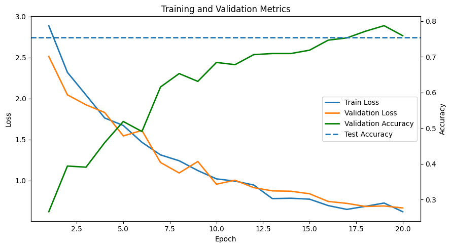
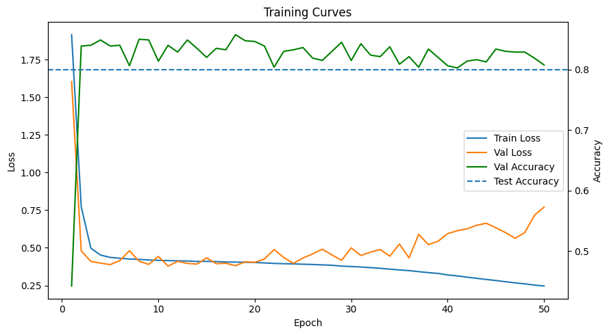
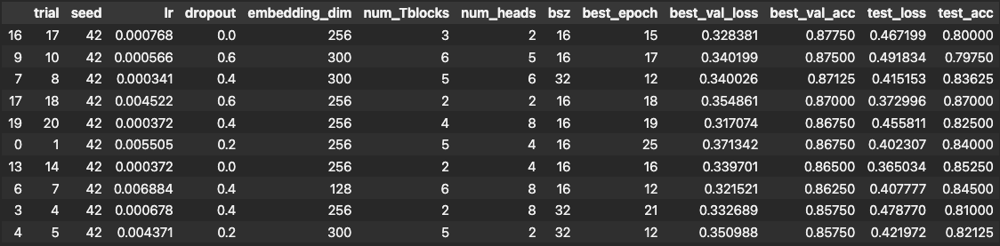
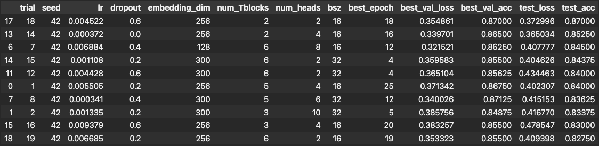

# Character-Level Language Modeling with MLP and Transformer

This project studies next-character prediction on a toy character dataset and compares a simple MLP baseline to an autoregressive Transformer. The main goal is to understand how much architectural inductive bias matters for sequence modeling, and how quickly a transformer can learn structured text-like data even in a relatively small setup.

## 1) Context / Key-concepts

We consider a character vocabulary of size $V$, where each character is mapped to an integer index in $\{1, ..., V\}$. A sequence of length $T$ is denoted by $x = (x_1, x_2, ..., x_T)$, where each $x_t$ is a character token.The task is next-character prediction.

## 2) Implementation details

The project uses a toy character dataset for the main experiments, and an extension to Wikipedia text is planned for future experiments. The toy data is intentionally simple and therefore useful for quickly validating model behavior, training dynamics, and sampling quality.

Example sentence of the toy dataset: "the short man goes ( for the gorgeous bear ) . the koala walks to the lawyer . a willowy businesswom"


### 2.1) Baseline: MLP (toy data)

For the baseline MLP, a full input sequence is used to predict only the single next character: $(x_1, ..., x_T) -> x_{T+1}$. This gives one classification target per sequence.

Architecture:
- sequence length: 64
- batch size: 16
- embedding dimension: 30
- indput dimension: $64 * 30 = 1920$ 
- hidden dimension: 512
- output dimension: 31 (1 class per character)
- optimizer: Adam
- epochs: 20    
- lr: 1e-3      

### 2.2) Transformer (toy data)

For the autoregressive transformer, the model predicts the next character at every position: $(x_1, ..., x_T) -> (x_2, ..., x_{T+1})$. Thus, the model outputs logits of shape $(B, T, V)$, where B = batch size, T = sequence length and V = vocabulary size. Since the transformer is autoregressive, a causal attention mask ist used so that token $x_t$ can only use information up to position t.

Architecture:
- attention heads: 6
- transformer blocks: 4
- embedding dimension: 300
- dropout: 0.3
- device: CUDA
- vocabulary size: 31
- context length: 128
- batches per epoch: 100

Training setup
- epochs: 50
- learning rate: 0.001
- batchs size: 32
- early stopping patience: 50
- early stopping min delta: 0.0005


### 2.3) Random search setup

A small random search was used to explore whether the transformer is sensitive to moderate changes in architecture and optimization settings. Although this is not strictly necessary on the toy dataset, it still provides a useful sanity check and helps identify rough hyperparameter trends. The sampled search space was:

- learning rate: $10^u, u ∼ U(-3.5, -2.0)$
- dropout: $\{0.0, 0.2, 0.4, 0.6\}$
- embedding dimensions: $\{128, 256, 300\}$
- number of transformer blocks: $\{2, 3, 4, 5, 6\}$
- batch size: $\{16, 32\}$
- number of heads chosen such that it divides the embedding dimension

A total of 20 random configurations were sampled and ran for 25 epochs with a fixed sequence length of 128 and dropout patience of 10.


### 2.4) Transformer (wiki data) tbd

tbd


## 3) Results

### 3.1) Baseline MLP (toy data)

Final result:
- test loss: 0.775
- test acc: 0.741

Sample output:
"an ( with a systematie dog khile a kawyer . a jy man imp )ie walked ( while a busy dungawbunt ( ran"

Despite the simple setup and roughly chosen hyperparameters, the model already reaches a recognizable performance level. Even in the sampled output, some structure is visible, including plausible syllables and occasional word-like fragments. The training progress looks almost textbook perfect

 


### 3.2) Transformer (toy data)

Final result:
- test loss: 0.487
- test acc: 0.800

Sample output: "goes ( at a reluctant teacher ) . the quick woman went . the businessman ran quickly . a woman runs"

The autoregressive transformer shows very fast and effective learning on the toy dataset. Both training and validation loss drop sharply within the first few epochs, while validation accuracy quickly rises to around 80%, indicating that the model captures the underlying structure of the language-like data very efficiently. The generated sample supports this impression, as it already contains clear structure and plausible word-like patterns.

Since early stopping was effectively disabled here (patience = 50 for a 50-epoch run), the curves also show clear signs of beginning overfitting toward the end: the training loss continues to decrease steadily, while the validation loss starts to rise again after its minimum. Overall, this suggests that the model learns the toy language very well and very quickly. This makes it especially interesting to test the same autoregressive setup on a more realistic dataset with natural language.




### 3.3) Random Search Results

The random search was run over 20 different configurations, with sequence length fixed to 128 and early stopping patience set to 10. The first ranking was sorted by best validation accuracy, the second by test accuracy.

Overall, the results support the idea that the toy dataset is relatively easy for this model class: all tested configurations achieved a test accuracy above 80%, with the best runs reaching around 87%. The ranking also suggests that while lower dropout may help peak validation performance, stronger dropout can slightly improve generalization.

We also observe that a relatively high learning rate can partly compensate for a smaller architecture, as some strong runs use only 2 transformer blocks and 2 heads. More generally, both larger architectures and higher learning rates can produce strong performance on this toy task. This balance may change for longer training runs, where smaller learning rates and larger models could become more favorable, while high learning rates may begin to overshoot.




### 3.4) Transformer on Wikipedia data

to be added

The next natural step is to evaluate whether the same autoregressive setup scales to a more realistic language dataset such as Wikipedia.


## Project structure

```
repo-name/
├── README.md
├── requirements.txt                 
├── src/
│   ├── model.py                   
│   ├── train.py                
│   ├── data_utils.py              
├── data/
│   └── Planetoid
│   └── ogbn_arxiv                
├── notebooks/
│   └── experiments.ipynb  
├── configs/
│   └── default_config.yaml
│   └── citeseer.yaml
│   └── pubmed.yaml   
│   └── ogbn_arxiv_full_batch.yaml
│   └── pubmed_config_mini_batch.yaml
├── results/
    └── ... 
```

## How to run

Main packages used in this project:
- PyTorch
- NumPy
- Matplotlib
- PyYAML

Run baseline:

`python -m src.train_baseline`

Run custom config:

`python -m src.train_baseline --config configs/default_config.yaml`